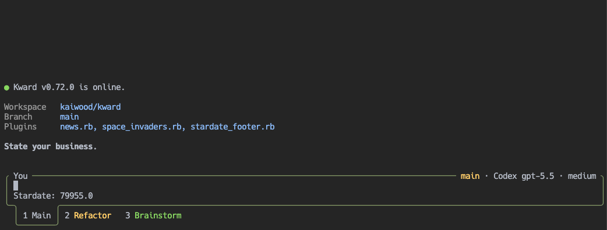

<p align="center">
  
</p>

# Kward

<p align="center"><strong>An extensible Ruby coding agent for your terminal.</strong></p>

<p align="center">
  <a href="https://github.com/kaiwood/kward/actions/workflows/ci.yml"></a>
  <a href="https://rubygems.org/gems/kward"></a>
  <a href="https://kaiwood.github.io/kward/"></a>
</p>

Kward is a coding agent for your terminal. It can inspect and edit a project, run commands, research problems, and save your work in sessions you can resume later.

Use Kward from the terminal, its local browser interface, or a trusted JSON-RPC client. It works with ChatGPT/Codex and Claude subscriptions, hosted model APIs, GitHub Copilot, OpenRouter, and local servers such as Ollama, LM Studio, and llama.cpp.

## Why Kward?

Software work rarely fits into one chat. A project can span days of research, implementation, debugging, review, and decisions worth keeping.

Kward treats that work as an ongoing workspace rather than a disposable conversation. You can resume earlier sessions, split work across tabs and Git worktrees, and keep project guidance close to the code. Optional permissions, command sandboxing, and workspace boundaries give you more control when a task needs it.

Start with a normal coding conversation. If your workflow grows, you can add memory, reusable prompts and skills, local plugins, lifecycle hooks, MCP servers, transports, or a custom RPC client.

<p align="center">
  
</p>

## Install

Install Kward from RubyGems:

```bash
gem install kward
```

Optionally install the starter pack after installation:

```bash
kward init
```

This downloads Kward's default prompts and base `PRINCIPLES.md` into your config directory. It is useful for a first setup, but safe to skip if you prefer to create your own instructions. Existing files are left untouched.

Then sign in and start Kward:

```bash
kward login                    # sign in or save provider credentials
kward                          # start an interactive chat
kward help                     # show available commands and examples
kward hooks doctor             # inspect lifecycle hook setup
kward "Explain this project"   # run one prompt and exit
kward --working-directory ~/code/project "Explain this project"
```

From inside Kward, `/login` lets you choose API-key or subscription authentication across supported providers. `/model` then switches providers, refreshes model catalogs, or accepts a manual model/deployment ID. Direct OpenAI API credentials and ChatGPT/Codex OAuth can coexist.

See [Model providers](doc/providers.md) to choose a backend and [Authentication](doc/authentication.md) for credential storage and login flows.

## Common ways to use Kward

- Explore an unfamiliar codebase and keep useful discoveries for later sessions.
- Investigate a bug, make a focused change, and run the related tests.
- Review a diff, inspect the surrounding code, and commit from the terminal UI.
- Work on several tasks at once with tabs, branches, and linked Git worktrees.
- Teach Kward your project conventions with `AGENTS.md`, skills, prompt templates, and optional memory.
- Add trusted local behavior through plugins, lifecycle hooks, MCP servers, transports, or JSON-RPC integrations.

## Documentation

New to Kward:

- [Getting started](doc/getting-started.md): first run, authentication choices, and basic commands.
- [Usage](doc/usage.md): interactive chat, slash commands, sessions, tools, images, and Pan mode.
- [Configuration](doc/configuration.md): config files, providers, models, web search, logging, and color output.
- [Authentication](doc/authentication.md): multi-provider API keys, OpenAI/Anthropic subscription OAuth, Azure setup, and credential safety.
- [Model providers](doc/providers.md): compare providers and find their runtime IDs, model keys, environment variables, discovery behavior, and limitations.

Work safely:

- [Security and trust](doc/security.md): local permissions, external data flow, trusted extensions, and safe work in unfamiliar repositories.
- [Security policy](https://github.com/kaiwood/kward/blob/main/SECURITY.md): privately report suspected vulnerabilities and understand supported security-fix versions.
- [Platform support](doc/platform-support.md): macOS, Linux, WSL, native Windows, terminal, and sandbox support expectations.
- [Permissions](doc/permissions.md): opt-in tool approval, write scopes, policy rules, and current limits.
- [Command sandboxing](doc/sandboxing.md): opt-in OS-enforced boundaries for model-requested shell commands.
- [Troubleshooting](doc/troubleshooting.md): environment-specific install and runtime issues.

Everyday workflows:

- [Sessions](doc/session-management.md): resume, clone, fork, rewind, compact, and navigate saved work.
- [Interactive composer](doc/composer.md): use multiline input, completion, history, files, reasoning selection, busy input, and images.
- [Tabs](doc/tabs.md): keep several conversations open and run work in another tab.
- [Project files](doc/files.md): browse, search, mention, open, and edit workspace files.
- [Integrated editor](doc/editor.md): open files from the shell or composer, edit in-place, and choose editor keybindings.
- [Git](doc/git.md): review changes, use the diff viewer, stage files, and commit from the interactive TUI.
- [Shell](doc/shell.md): use `/shell`, the embedded Kward shell with aliases, completion, and per-tab state.
- [Memory](doc/memory.md): opt-in core, soft, and session memory.
- [Personas](doc/personas.md): configure Kward's tone and role by default, workspace, model, reasoning effort, time, and weekday.
- [Skills](doc/skills.md): add reusable instructions that load only for matching tasks.
- [Prompt templates](doc/prompt-templates.md): create reusable slash prompts and use the starter templates installed by `kward init`.
- [MCP servers](doc/mcp.md): connect trusted local Model Context Protocol tool servers.
- [Pan mode](doc/pan.md): use the mobile-friendly local browser interface or explicitly expose it to a trusted LAN.
- [Local models](doc/local-models.md): connect Ollama, LM Studio, or llama.cpp and use a minimal replacement prompt.

Extend and integrate:

- [Extensibility](doc/extensibility.md): choose between `PRINCIPLES.md`, workspace `AGENTS.md`, skills, prompt templates, and other extension points.
- [Plugins](doc/plugins.md): trusted Ruby plugins for commands, footer UI, prompt context, transcript events, and RPC clients.
- [Lifecycle hooks](doc/lifecycle-hooks.md): deterministic runtime hooks for policy, approvals, automation, and command-hook integrations.
- [RPC protocol](doc/rpc.md): JSON-RPC backend mode for trusted local UI clients.
- [Releasing](doc/releasing.md): prepare a version and publish it through RubyGems and GitHub Releases.

Reference guides:

- [Agent tools](doc/agent-tools.md): overview of model-callable tools, token-saving behavior, and tool categories.
- [Workspace tools](doc/workspace-tools.md): local file, edit, and shell command tools.
- [Context budgeting](doc/context-budgeting.md): focused context gathering, budgeted reads, output compaction, and token-saving history.
- [Web search](doc/web-search.md): live search providers and network behavior for the web search agent tool.
- [Code search](doc/code-search.md): package lookup, GitHub repository cache, and external source reading for the code search agent tool.
- [Context tools](doc/context-tools.md): skills, compacted output retrieval, and structured clarification questions.

Generated Ruby API:

- [API reference](doc/api.md): generated Ruby API entry points, indexes, and supported API expectations.

## Development

Read [Contributing to Kward](https://github.com/kaiwood/kward/blob/main/CONTRIBUTING.md) before preparing a pull request. Participation is governed by the [Code of conduct](https://github.com/kaiwood/kward/blob/main/CODE_OF_CONDUCT.md).

Run tests:

```bash
bundle exec rake test
```

Preview the built YARD documentation site locally with automatic rebuilds:

```bash
bundle exec rake docs:serve
```

The preview builds `_yardoc/`, serves it with WEBrick using `Cache-Control: no-store`, and rebuilds in a fresh process when documentation sources, library code, or templates change. Generated HTML, images, CSS, and JavaScript match the published site. Open <http://localhost:8808/> and refresh your browser after rebuilds. Use `PORT=4000 bundle exec rake docs:serve` to choose another port.

Build the static YARD documentation site for publishing:

```bash
bundle exec rake docs:build
```

The generated site is written to `_yardoc/`. Pushes to `main` deploy that directory to GitHub Pages.

Check generated documentation links, images, and scripts:

```bash
bundle exec rake docs:check
```

External link checks are disabled by default for stable local runs. Enable them with `DOCS_CHECK_EXTERNAL=1 bundle exec rake docs:check`.

Generate the RDoc API documentation:

```bash
bundle exec rake rdoc
```
